## EdgeX中messagebus功能整理

### CoreCommand

#### SubscribeCommandRequests 

 (interal/core/command/controller/messaging/internal.go)

订阅来自EdgeX service的command请求，并将请求转发给DeviceService。

```go
// SubscribeCommandRequests subscribes command requests from EdgeX service (e.g., Application Service)
// and forwards them to the appropriate Device Service via internal MessageBus
func SubscribeCommandRequests(ctx context.Context, requestTimeout time.Duration, dic *di.Container) errors.EdgeX {
	.....

	go func() {
		for {
			select {
			case <-ctx.Done():
				lc.Infof("Exiting waiting for MessageBus '%s' topic messages", requestCommandTopic)
				return
			case err = <-messageErrors:
				lc.Error(err.Error())
			case requestEnvelope := <-messages:
				processDeviceCommandRequest(messageBus, requestEnvelope, baseTopic, requestTimeout, lc, dic)
			}
		}
	}()


	return nil
}
```

processDeviceCommandRequest首先将得到的requestEnvelope拆解ReceivedTopic，分别获得deviceName、commandName、method，接着拼接出请求这个device的deviceRequestTopic，向这个device发起请求，将device响应结果返还给一开始请求的服务。

```go
func processDeviceCommandRequest(...) {
	...

	// internal response topic scheme: <ResponseTopicPrefix>/<service-name>/<request-id>
    // 这个应该是还给发给他消息的topic
	internalResponseTopic := common.BuildTopic(baseTopic, common.ResponseTopic, common.CoreCommandServiceKey, requestEnvelope.RequestID)
	topicLevels := strings.Split(requestEnvelope.ReceivedTopic, "/")
	length := len(topicLevels)
	...
    
	// expected internal command request/response topic scheme: #/<device>/<command-name>/<method>
	deviceName := topicLevels[length-3]
	commandName, err := url.QueryUnescape(topicLevels[length-2])
	...
	method := topicLevels[length-1]
	...

	topicPrefix := common.BuildTopic(baseTopic, common.CoreCommandDeviceRequestPublishTopic)
	// internal command request topic scheme: <DeviceRequestTopicPrefix>/<device-service>/<device>/<command-name>/<method>
    // 这里做了验证，并且得到请求的devicetopic
	deviceServiceName, deviceRequestTopic, err := validateRequestTopic(topicPrefix, deviceName, commandName, method, dic)
	...
    // 构建需要请求device的topic
	deviceResponseTopicPrefix := common.BuildTopic(baseTopic, common.ResponseTopic, deviceServiceName)

	...
    // 获取device的响应
	response, err := messageBus.Request(requestEnvelope, deviceRequestTopic, deviceResponseTopicPrefix, requestTimeout)
	...

	// original request is from internal MessageBus
    // 返回给最开始请求过来的地方
	err = messageBus.Publish(*response, internalResponseTopic)
	...
}

```

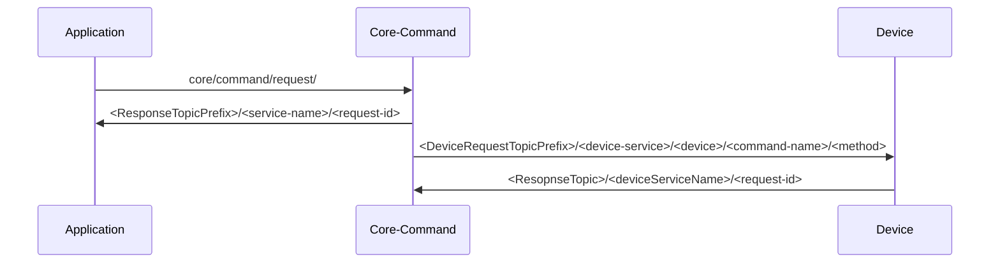

#### SubscribeCommandQueryRequests

 (interal/core/command/controller/messaging/internal.go)

EdgeX service发起command query请求，来获取命令

```go
// SubscribeCommandQueryRequests subscribes command query requests from EdgeX service (e.g., Application Service)
// via internal MessageBus
func SubscribeCommandQueryRequests(ctx context.Context, dic *di.Container) errors.EdgeX {
	....
	go func() {
		for {
			select {
			case <-ctx.Done():
				lc.Infof("Exiting waiting for MessageBus '%s' topic messages", queryRequestTopic)
				return
			case err = <-messageErrors:
				lc.Error(err.Error())
			case requestEnvelope := <-messages:
				processCommandQueryRequest(messageBus, requestEnvelope, baseTopic, lc, dic)
			}
		}
	}()

	return nil
}
```

```go
func processCommandQueryRequest(...) {

    ...
	// example topic scheme: /commandquery/request/<device>
	// deviceName is expected to be at last topic level.
    // 拆分topic，得到deviceName
	topicLevels := strings.Split(requestEnvelope.ReceivedTopic, "/")
	deviceName := topicLevels[len(topicLevels)-1]
	if strings.EqualFold(deviceName, common.All) {
		deviceName = common.All
	}
	
    // 根据设备名称，获取command列表
	responseEnvelope, err := getCommandQueryResponseEnvelope(requestEnvelope, deviceName, dic)
	...

	// internal response topic scheme: <ResponseTopicPrefix>/<service-name>/<request-id>
    // 构建响应topic <ResponseTopicPrefix>/<service-name>/<request-id>
	internalQueryResponseTopic := common.BuildTopic(baseTopic, common.ResponseTopic, common.CoreCommandServiceKey, requestEnvelope.RequestID)
	...
	
    // 发回响应
	err = messageBus.Publish(responseEnvelope, internalQueryResponseTopic)
	...
}
```

```go
// getCommandQueryResponseEnvelope returns the MessageEnvelope containing the DeviceCoreCommand payload bytes
func getCommandQueryResponseEnvelope(requestEnvelope types.MessageEnvelope, deviceName string, dic *di.Container) (types.MessageEnvelope, error) {
	var commandsResponse any
	var err error

	switch deviceName {
	case common.All:
		offset, limit := common.DefaultOffset, common.DefaultLimit
        // 根据QueryParams设置limit和offset
		if requestEnvelope.QueryParams != nil {
			if offsetRaw, ok := requestEnvelope.QueryParams[common.Offset]; ok {
				offset, err = strconv.Atoi(offsetRaw)
				...
			}
			if limitRaw, ok := requestEnvelope.QueryParams[common.Limit]; ok {
				limit, err = strconv.Atoi(limitRaw)
				...
			}
		}
		// 根据limit和offset获取所有command
		commands, totalCounts, edgexError := application.AllCommands(offset, limit, dic)
		...
		
        // 构造返回结果响应
		commandsResponse = responses.NewMultiDeviceCoreCommandsResponse(requestEnvelope.RequestID, "", http.StatusOK, totalCounts, commands)
	default:
        // 根据devicename获取所有command
		commands, edgexError := application.CommandsByDeviceName(deviceName, dic)
		...
		// 构造返回结果响应
		commandsResponse = responses.NewDeviceCoreCommandResponse(requestEnvelope.RequestID, "", http.StatusOK, commands)
	}
	
	responseBytes, err := json.Marshal(commandsResponse)
	...
	
	responseEnvelope, err := types.NewMessageEnvelopeForResponse(responseBytes, requestEnvelope.RequestID, requestEnvelope.CorrelationID, common.ContentTypeJSON)
	...
	
	return responseEnvelope, nil
}
```

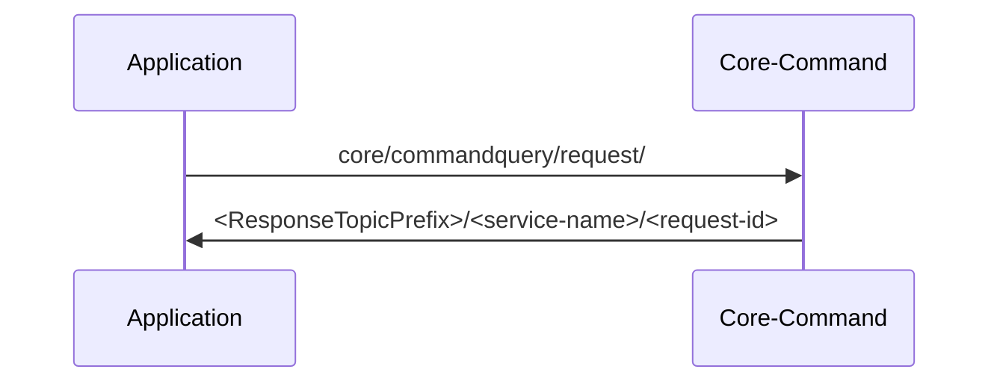

### CoreData

#### SubscribeEvents

(interal/core/data/controller/messaging/subscriber.go)

当外界增加了event内容以后，会发布一个event相关的topic，CoreData负责订阅这个topic，并调用自身的AddEvent

```go
// SubscribeEvents subscribes to events from message bus
func SubscribeEvents(ctx context.Context, dic *di.Container) errors.EdgeX {
	...

	go func() {
		for {
			select {
			...
			case msgEnvelope := <-messages:
				...
				event := &requests.AddEventRequest{}
				// decoding the large payload may cause memory issues so checking before decoding
				maxEventSize := dataContainer.ConfigurationFrom(dic.Get).MaxEventSize
				edgeXerr := utils.CheckPayloadSize(msgEnvelope.Payload, maxEventSize*1024)
				...
				err = unmarshalPayload(msgEnvelope, event)
				...
                // 验证Event
				err = validateEvent(msgEnvelope.ReceivedTopic, event.Event)
				...
                // 调用app.AddEvent
				err = app.AddEvent(requests.AddEventReqToEventModel(*event), ctx, dic)
				...
			}
		}
	}()

	return nil
}
```

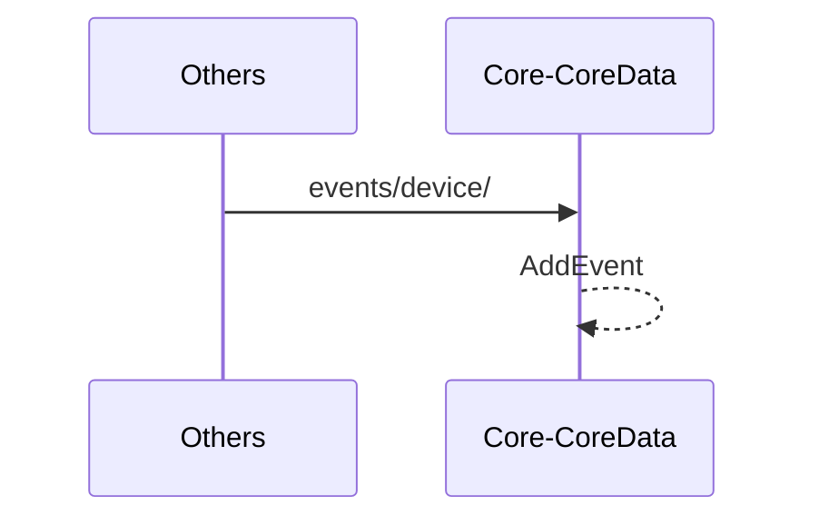

#### PublishEvent

 (interal/core/data/application/event.go)

当别的应用调用CoreData的httpcontroller使用这个AddEvent的时候，会开一个协程，将这个Add事件放到messageBus上

```go
func (ec *EventController) AddEvent(w http.ResponseWriter, r *http.Request) {
	....
    // 开一个协程，发布event
		go ec.app.PublishEvent(dataBytes, serviceName, profileName, deviceName, sourceName, ctx, ec.dic)
	....
}
```

```go
// PublishEvent publishes incoming AddEventRequest in the format of []byte through MessageClient
func (a *CoreDataApp) PublishEvent(data []byte, serviceName string, profileName string, deviceName string, sourceName string, ctx context.Context, dic *di.Container) {
	...
    // 构造topic
	publishTopic := common.BuildTopic(basePrefix, common.EventsPublishTopic, CoreDataEventTopicPrefix, serviceName, profileName, deviceName, url.QueryEscape(sourceName))
	...
    // 转换内容
	msgEnvelope := msgTypes.NewMessageEnvelope(data, ctx)
    // 进行发布
	err := msgClient.Publish(msgEnvelope, publishTopic)
	...
}
```

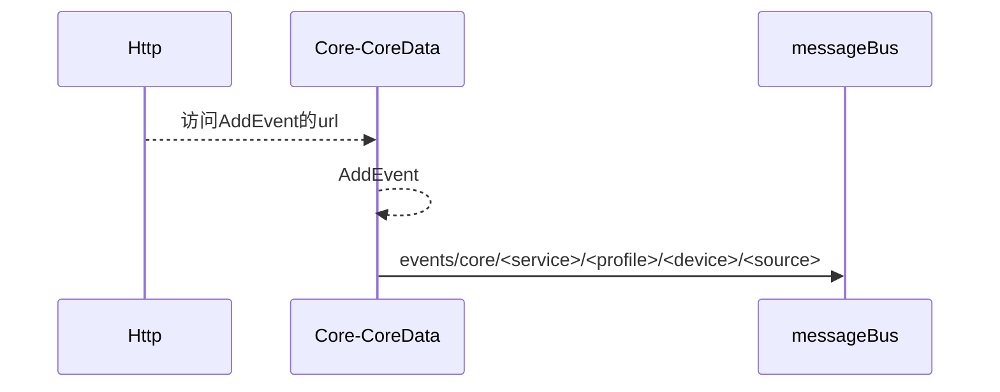

### CoreMetaData

#### device

##### AddDevice

```go
func AddDevice(d models.Device, ctx context.Context, dic *di.Container) (id string, edgeXerr errors.EdgeX) {
	...
	// 添加device
	addedDevice, err := dbClient.AddDevice(d)
	...

	deviceDTO := dtos.FromDeviceModelToDTO(addedDevice)
    // 开一个协程，发布这个add的系统事件
	go publishSystemEvent(common.DeviceSystemEventType, common.SystemEventActionAdd, d.ServiceName, deviceDTO, ctx, dic)

	return addedDevice.Id, nil
}
```

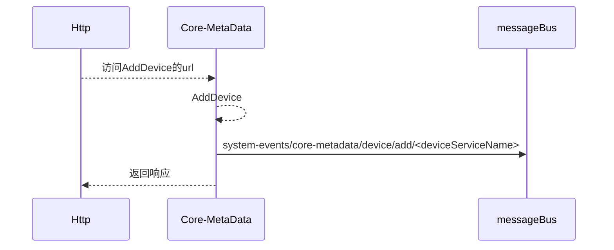

##### DeleteDeviceByName

```go
// DeleteDeviceByName deletes the device by name
func DeleteDeviceByName(name string, ctx context.Context, dic *di.Container) errors.EdgeX {
	...
    // 删除这个设备
	err = dbClient.DeleteDeviceByName(name)
	...
	deviceDTO := dtos.FromDeviceModelToDTO(device)
    // 开一个协程发送发布这个消息
	go publishSystemEvent(common.DeviceSystemEventType, common.SystemEventActionDelete, device.ServiceName, deviceDTO, ctx, dic)

	return nil
}
```

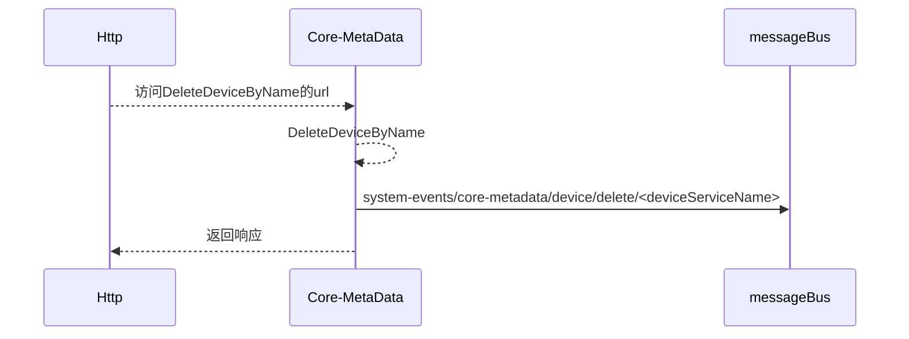

##### PatchDevice

```go
// PatchDevice executes the PATCH operation with the device DTO to replace the old data
func PatchDevice(dto dtos.UpdateDevice, ctx context.Context, dic *di.Container) errors.EdgeX {
	// Old service name is used for invoking callback
	var oldServiceName string
	if dto.ServiceName != nil && *dto.ServiceName != device.ServiceName {
		oldServiceName = device.ServiceName
	}
    ...
	// 更新device
	err = dbClient.UpdateDevice(device)
    ...
	
    // 如果修改了deviceService
	if oldServiceName != "" {
		go publishSystemEvent(common.DeviceSystemEventType, common.SystemEventActionUpdate, oldServiceName, deviceDTO, ctx, dic)
	}

	go publishSystemEvent(common.DeviceSystemEventType, common.SystemEventActionUpdate, device.ServiceName, deviceDTO, ctx, dic)

	return nil
}
```

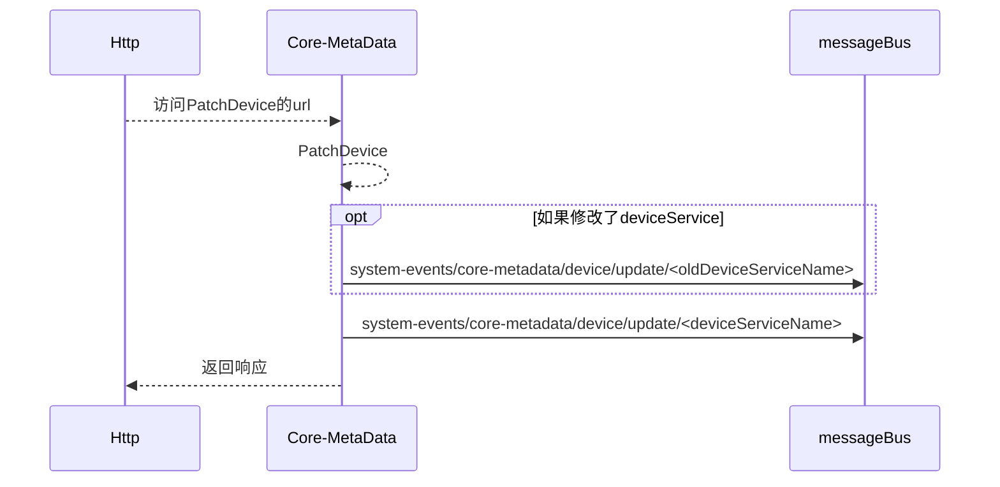

#### devicecommand

##### AddDeviceProfileDeviceCommand

```go
func AddDeviceProfileDeviceCommand(profileName string, deviceCommand models.DeviceCommand, ctx context.Context, dic *di.Container) errors.EdgeX {
    ...
    // 获取deviceProfile
	profile, err := dbClient.DeviceProfileByName(profileName)
	...
    // 更新profile的deviceCommand
	profile.DeviceCommands = append(profile.DeviceCommands, deviceCommand)
	...
    // 更新deviceProfile
	err = dbClient.UpdateDeviceProfile(profile)
    ...
    // 异步发布更新DeviceProfile系统事件
	go publishUpdateDeviceProfileSystemEvent(profileDTO, ctx, dic)

	return nil
}
```

```go
func publishUpdateDeviceProfileSystemEvent(profileDTO dtos.DeviceProfile, ctx context.Context, dic *di.Container) {
	...
	//Publish general system event regardless of associated devices
	publishSystemEvent(common.DeviceProfileSystemEventType, common.SystemEventActionUpdate, common.CoreMetaDataServiceKey, profileDTO, ctx, dic)
	// Publish system event for each device service
	dsMap := make(map[string]bool)
	for _, d := range devices {
		if _, ok := dsMap[d.ServiceName]; ok {
			// skip the invoked device service
			continue
		}
		dsMap[d.ServiceName] = true

		publishSystemEvent(common.DeviceProfileSystemEventType, common.SystemEventActionUpdate, d.ServiceName, profileDTO, ctx, dic)
	}
}

```

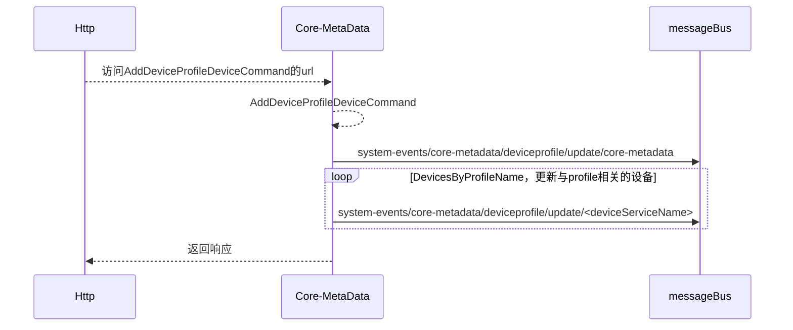

##### PatchDeviceProfileDeviceCommand

```go
func PatchDeviceProfileDeviceCommand(profileName string, dto dtos.UpdateDeviceCommand, ctx context.Context, dic *di.Container) errors.EdgeX {
	...
    // 根据名字获取profile
	profile, err := dbClient.DeviceProfileByName(profileName)
	...

	// Find matched deviceCommand
    // 找到匹配的deviceCommand
	index := -1
	for i := range profile.DeviceCommands {
		if profile.DeviceCommands[i].Name == *dto.Name {
			index = i
			break
		}
	}
	...
    // 更新profile.DeviceCommands
	requests.ReplaceDeviceCommandModelFieldsWithDTO(&profile.DeviceCommands[index], dto)
	// 更新deviceProfile
	err = dbClient.UpdateDeviceProfile(profile)
	// 开一个协程发布Profile更新，逻辑与上面的相同
	go publishUpdateDeviceProfileSystemEvent(profileDTO, ctx, dic)

	return nil
}
```

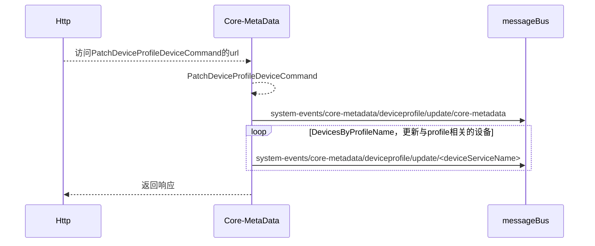

##### DeleteDeviceCommandByName

```go
func DeleteDeviceCommandByName(profileName string, commandName string, ctx context.Context, dic *di.Container) errors.EdgeX {
	...
    // 确保这个profile没有绑定的device
	devices, err := dbClient.DevicesByProfileName(0, 1, profileName)
    if err != nil {
		return errors.NewCommonEdgeXWrapper(err)
	} else if len(devices) > 0 {
		return errors.NewCommonEdgeX(errors.KindStatusConflict, "fail to update the device profile when associated device exists", nil)
	}
	...
    // 根据profileName来获取DeviceProfile
	profile, err := dbClient.DeviceProfileByName(profileName)
	...
	// 找到命令后，删除命令
	profile.DeviceCommands = append(profile.DeviceCommands[:index], profile.DeviceCommands[index+1:]...)
    ...
	// 更新profile
	err = dbClient.UpdateDeviceProfile(profile)
	...
    // 发布一个异步的profile更新事件
	go publishUpdateDeviceProfileSystemEvent(profileDTO, ctx, dic)
	return nil
}
```

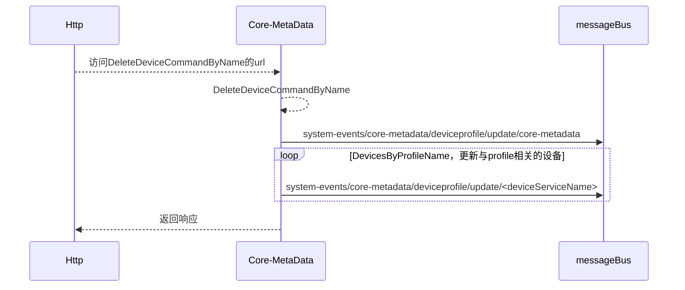

#### deviceprofile

##### AddDeviceProfile

```go
// The AddDeviceProfile function accepts the new device profile model from the controller functions
// and invokes addDeviceProfile function in the infrastructure layer
func AddDeviceProfile(d models.DeviceProfile, ctx context.Context, dic *di.Container) (id string, err errors.EdgeX) {
	...
    // 添加一个deviceprofile
	addedDeviceProfile, err := dbClient.AddDeviceProfile(d)
	...
    // 发布一个异步的添加deviceprofile的系统事件
	go publishSystemEvent(common.DeviceProfileSystemEventType, common.SystemEventActionAdd, common.CoreMetaDataServiceKey, profileDTO, ctx, dic)

	return addedDeviceProfile.Id, nil
}
```

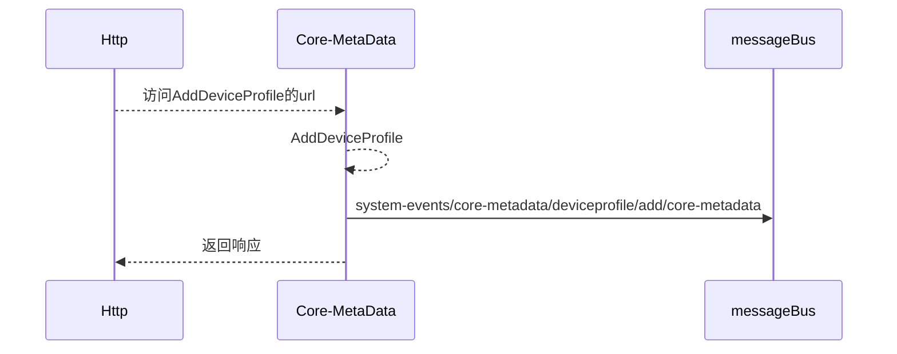

##### UpdateDeviceProfile

```go
// The UpdateDeviceProfile function accepts the device profile model from the controller functions
// and invokes updateDeviceProfile function in the infrastructure layer
func UpdateDeviceProfile(d models.DeviceProfile, ctx context.Context, dic *di.Container) (err errors.EdgeX) {
	...
    // 更新profile
	err = dbClient.UpdateDeviceProfile(d)
	...
    // 发布一个异步的deviceprofile更新
	go publishUpdateDeviceProfileSystemEvent(profileDTO, ctx, dic)

	return nil
}
```

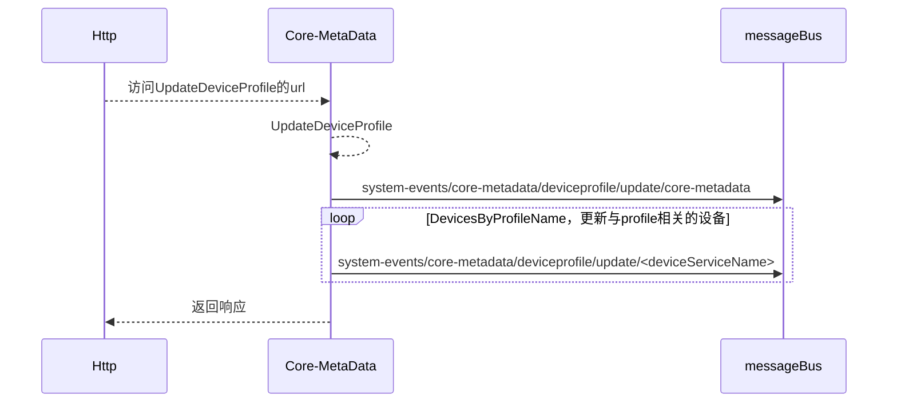

##### DeleteDeviceProfileByName

```go
// DeleteDeviceProfileByName delete the device profile by name
func DeleteDeviceProfileByName(name string, ctx context.Context, dic *di.Container) errors.EdgeX {
	....
    // 如果设置了deviceprofile禁止删除的化就不能删除
	if strictProfileDeletes {
		return errors.NewCommonEdgeX(errors.KindServiceLocked, "profile deletion is not allowed when StrictDeviceProfileDeletes config is enabled", nil)
	}
	....
	// 根据名字删除profile
	err = dbClient.DeleteDeviceProfileByName(name)
    ....
    // 发布一个异步的deviceprofile删除系统事件
	go publishSystemEvent(common.DeviceProfileSystemEventType, common.SystemEventActionDelete, common.CoreMetaDataServiceKey, profileDTO, ctx, dic)

	return nil
}
```

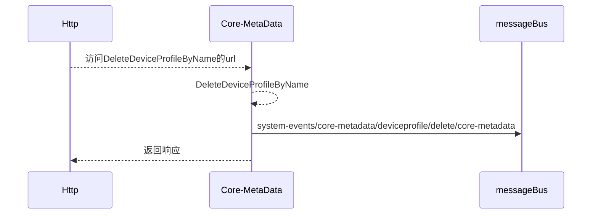

##### PatchDeviceProfileBasicInfo

```go
func PatchDeviceProfileBasicInfo(ctx context.Context, dto dtos.UpdateDeviceProfileBasicInfo, dic *di.Container) errors.EdgeX {
	....
    // 更新deviceprofile的BasicInfo
	requests.ReplaceDeviceProfileModelBasicInfoFieldsWithDTO(&deviceProfile, dto)
	err = dbClient.UpdateDeviceProfile(deviceProfile)
	// 发布一个异步的更新profile系统事件
	go publishUpdateDeviceProfileSystemEvent(profileDTO, ctx, dic)

	return nil
}
```

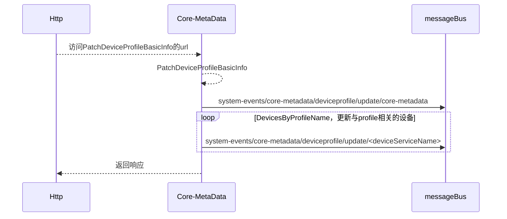

#### deviceresource

##### AddDeviceProfileResource

```go
func AddDeviceProfileResource(profileName string, resource models.DeviceResource, ctx context.Context, dic *di.Container) errors.EdgeX {
    ....
	// 修改profile.DeviceResource
	profile.DeviceResources = append(profile.DeviceResources, resource)
	....
	// 更新profile
	err = dbClient.UpdateDeviceProfile(profile)
    ....
	// 发布一个异步的deviceprofile更新事件
	go publishUpdateDeviceProfileSystemEvent(profileDTO, ctx, dic)

	return nil
}
```

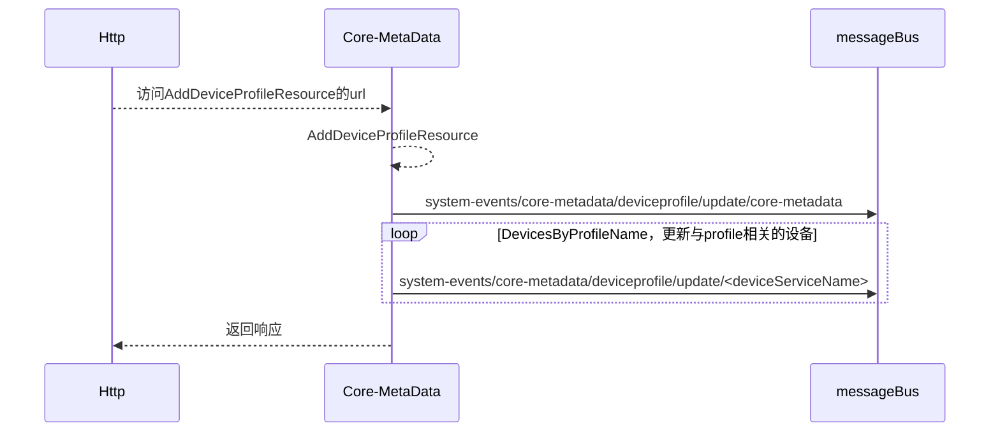

##### PatchDeviceProfileResource

```go
func PatchDeviceProfileResource(profileName string, dto dtos.UpdateDeviceResource, ctx context.Context, dic *di.Container) errors.EdgeX {
	....
	// 找到匹配的resource的index，并对它进行更新
	requests.ReplaceDeviceResourceModelFieldsWithDTO(&profile.DeviceResources[index], dto)
    // 更新profile
	....
    // 发布一个异步的deviceprofile更新事件
	go publishUpdateDeviceProfileSystemEvent(profileDTO, ctx, dic)

	return nil
}
```

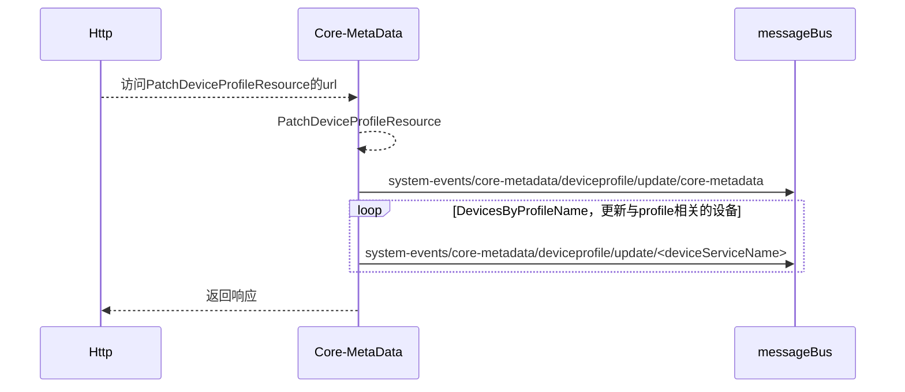

##### DeleteDeviceResourceByName

```go
func DeleteDeviceResourceByName(profileName string, resourceName string, ctx context.Context, dic *di.Container) errors.EdgeX {
	....
    // 如果不允许更改的话，就停止
	if strictProfileChanges {
		return errors.NewCommonEdgeX(errors.KindServiceLocked, "profile change is not allowed when StrictDeviceProfileChanges config is enabled", nil)
	}
	....
	// Check the associated Device existence
    // 检查相关的Device是否存在
	devices, err := dbClient.DevicesByProfileName(0, 1, profileName)
	if err != nil {
		return errors.NewCommonEdgeXWrapper(err)
	} else if len(devices) > 0 {
		return errors.NewCommonEdgeX(errors.KindStatusConflict, "fail to update the device profile when associated device exists", nil)
	}
	// 删除name对应的index的资源
	profile.DeviceResources = append(profile.DeviceResources[:index], profile.DeviceResources[index+1:]...)
	// 更新deviceprofile
	err = dbClient.UpdateDeviceProfile(profile)
	// 发布一个异步的deviceprofile更新事件
	go publishUpdateDeviceProfileSystemEvent(profileDTO, ctx, dic)
	return nil
}
```

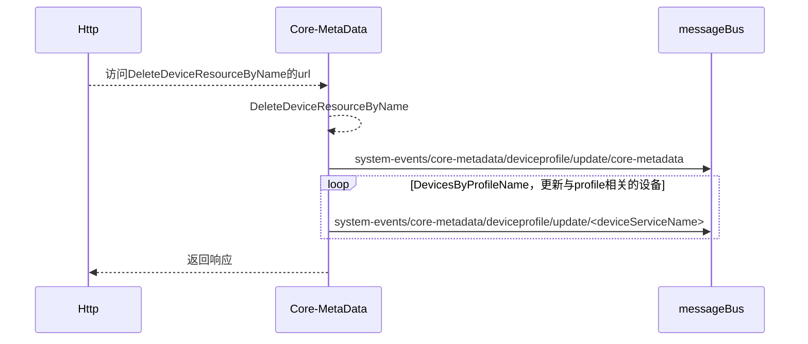

#### deviceservice

##### AddDeviceService

```go
// The AddDeviceService function accepts the new device service model from the controller function
// and then invokes AddDeviceService function of infrastructure layer to add new device service
func AddDeviceService(d models.DeviceService, ctx context.Context, dic *di.Container) (id string, err errors.EdgeX) {
	....
    // 添加DeviceService
	addedDeviceService, err := dbClient.AddDeviceService(d)
	....
    // 发布一个添加deviceService系统事件
	go publishSystemEvent(common.DeviceServiceSystemEventType, common.SystemEventActionAdd, d.Name, DeviceServiceDTO, ctx, dic)
	return addedDeviceService.Id, nil
}
```


##### PatchDeviceService

```go
// PatchDeviceService executes the PATCH operation with the device service DTO to replace the old data
func PatchDeviceService(dto dtos.UpdateDeviceService, ctx context.Context, dic *di.Container) errors.EdgeX {
	....
    // 更新deviceservice
	requests.ReplaceDeviceServiceModelFieldsWithDTO(&deviceService, dto)

	err = dbClient.UpdateDeviceService(deviceService)
	// 发布一个更新deviceService系统事件
	go publishSystemEvent(common.DeviceServiceSystemEventType, common.SystemEventActionUpdate, deviceService.Name, DeviceServiceDTO, ctx, dic)
	return nil
}
```

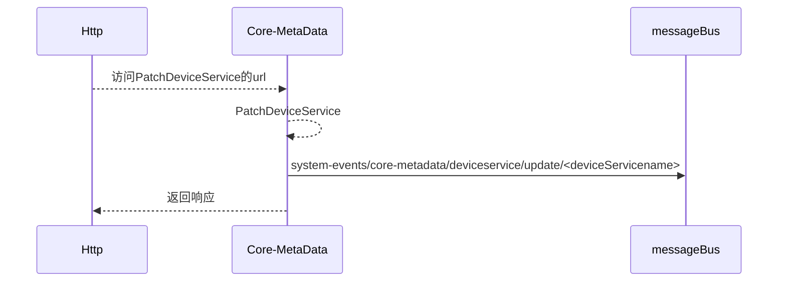

##### DeleteDeviceServiceByName

```go
func DeleteDeviceServiceByName(name string, ctx context.Context, dic *di.Container) errors.EdgeX {
	....
    // 删除deviceService
	err = dbClient.DeleteDeviceServiceByName(name)
	....
    // 发布一个删除deviceService系统事件
	go publishSystemEvent(common.DeviceServiceSystemEventType, common.SystemEventActionDelete, deviceService.Name, DeviceServiceDTO, ctx, dic)
	return nil
}
```

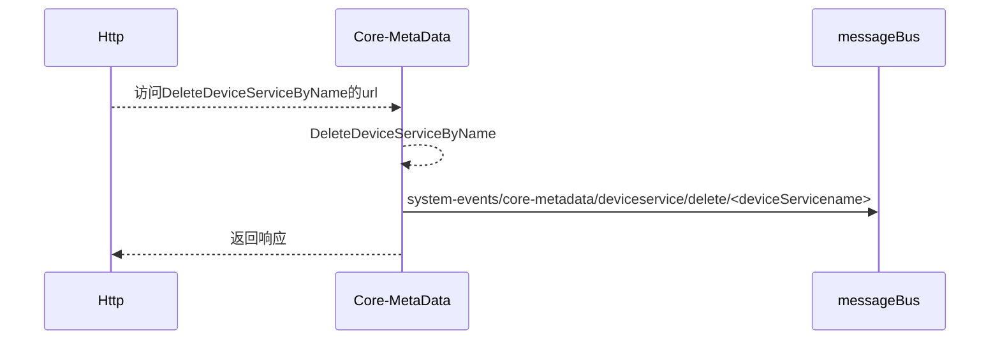

#### provisionwatcher

##### AddProvisionWatcher

```go
// AddProvisionWatcher function accepts the new provision watcher model from the controller function
// and then invokes AddProvisionWatcher function of infrastructure layer to add new device service
func AddProvisionWatcher(pw models.ProvisionWatcher, ctx context.Context, dic *di.Container) (id string, err errors.EdgeX) {
	....
    // 添加ProvisionWatcher
	addProvisionWatcher, err := dbClient.AddProvisionWatcher(pw)
	....
    // 发布一个添加provisionWatcher系统事件
	go publishSystemEvent(common.ProvisionWatcherSystemEventType, common.SystemEventActionAdd, pw.DiscoveredDevice.ServiceName, dtos.FromProvisionWatcherModelToDTO(pw), ctx, dic)
	return addProvisionWatcher.Id, nil
}
```

```mermaid
sequenceDiagram
	Http-->>Core-MetaData: 访问AddProvisionWatcher的url
	Core-MetaData-->>Core-MetaData: AddProvisionWatcher
	Core-MetaData->>messageBus: system-events/core-metadata/provisionwatcher/add/<pw.DiscoveredDevice.ServiceName>
	Core-MetaData-->>Http: 返回响应
```

##### DeleteProvisionWatcherByName

```go
// DeleteProvisionWatcherByName deletes the provision watcher by name
func DeleteProvisionWatcherByName(ctx context.Context, name string, dic *di.Container) errors.EdgeX {
	....
    // 删除ProvisionWatcher
	err = dbClient.DeleteProvisionWatcherByName(pw.Name)
	....
    // 发布一个删除provisionWatcher系统事件
	go publishSystemEvent(common.ProvisionWatcherSystemEventType, common.SystemEventActionDelete, pw.DiscoveredDevice.ServiceName, dtos.FromProvisionWatcherModelToDTO(pw), ctx, dic)
	return nil
}
```

```mermaid
sequenceDiagram
	Http-->>Core-MetaData: 访问AddProvisionWatcher的url
	Core-MetaData-->>Core-MetaData: AddProvisionWatcher
	Core-MetaData->>messageBus: system-events/core-metadata/provisionwatcher/delete/<pw.DiscoveredDevice.ServiceName>
	Core-MetaData-->>Http: 返回响应
```

##### PatchProvisionWatcher

```go
// PatchProvisionWatcher executes the PATCH operation with the provisionWatcher DTO to replace the old data
func PatchProvisionWatcher(ctx context.Context, dto dtos.UpdateProvisionWatcher, dic *di.Container) errors.EdgeX {
	....
    // 获取oldServiceName
	if dto.DiscoveredDevice.ServiceName != nil && *dto.DiscoveredDevice.ServiceName != pw.DiscoveredDevice.ServiceName {
		oldServiceName = pw.DiscoveredDevice.ServiceName
	}
	// 更新ProvisionWatcher
	err = dbClient.UpdateProvisionWatcher(pw)
	// 如果有旧的ServiceName
    // 向oldServiceName也发布一个事件
	if oldServiceName != "" {
		go publishSystemEvent(common.ProvisionWatcherSystemEventType, common.SystemEventActionUpdate, oldServiceName, dtos.FromProvisionWatcherModelToDTO(pw), ctx, dic)
	}
    // 发布一个更新事件
	go publishSystemEvent(common.ProvisionWatcherSystemEventType, common.SystemEventActionUpdate, pw.DiscoveredDevice.ServiceName, dtos.FromProvisionWatcherModelToDTO(pw), ctx, dic)
	return nil
}
```

```mermaid
sequenceDiagram
	Http-->>Core-MetaData: 访问PatchProvisionWatcher的url
	Core-MetaData-->>Core-MetaData: PatchProvisionWatcher
	opt 如果修改了deviceService
		Core-MetaData->>messageBus: system-events/core-metadata/provisionwatcher/update/<oldDeviceServiceName>
	end
	Core-MetaData->>messageBus: system-events/core-metadata/provisionwatcher/update/<deviceServiceName>
	Core-MetaData-->>Http: 返回响应
```

