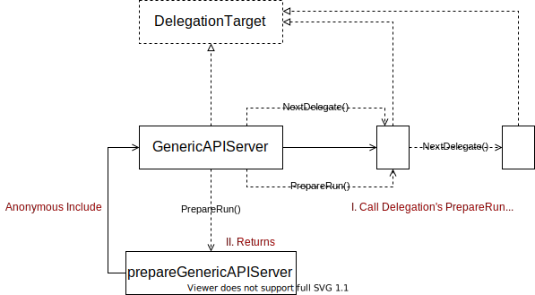

# Routes

## 流程梳理

### 部分介绍

1. FullHandlerChain

   FullHandlerChain的类型是http.Handler类型，是用于处理http请求的，有自己的ServeHTTP方法，其实就是Director的方法。**其实这里的FullHandlerChain本质上就是Director加上一些鉴权和认证的功能。**

2. Director

   Director的类型也是http.Handler类型，他的ServeHTTP是重载的，ServeHTTP的逻辑为**先判断能不能走GoRestfulContainer这个handler**，如果不能走这个handler，再走NonGoRestfulMux这个handler。

3. NonGoRestfulMux

   NonGoRestfulMux是调用链的最后一步，在所有的过滤器和API处理后执行他。主要针对非GoRestful类型的处理。

4. GoRestfulContainer

   已经注册的APIs，InstallAPIs会使用这个handler。

5. ServerChain

   ServerChain是在api-server在cobra命令行中的Run方法中构建的，构建顺序为NotFound Handler、Extension Server、Master Server、Aggregation Server。调用链的顺序为Aggregation Server、Master API Server、Extension Server、Not Found Handler。每个API Server会有自己的GenericAPIServer，每个GenericServer都会有一个自己的apiServerHandler，包装了以上四个东西。

### 访问流程

首先调用先到了Aggregation API Server，这个API Server会根据内容进行转发，可能会把内容交给Custom API Server进行处理，如果是Kubernetes内部的东西，会直接走Master 这个API Server，如果是用户自己扩展的东西，会走Extension Server这个API Server，再由最后走到的API Server交给他的FullHandlerChain（内部就是包装后的director，director内部就是两个分支，分别给NonGoRestfulMux和GoRestfulContainer）来进行处理。

### 细节目录

- [x] Director的ServeHTTP方法

  `vendor/k8s.io/apiserver/pkg/server/handler.go`

  [Director-ServeHTTP](https://pluviophile225.github.io/docs/apiserverhandler/)

- [x] ApiServerHandler的生成NewAPIServerHandler方法

  `vendor/k8s.io/apiserver/pkg/server/handler.go`

  [ApiServerHandler](./kube-apiserver process/ApiServerHandler.md)

- [x] Config结构体及相关内容

  `vendor/k8s.io/apiserver/pkg/server/config.go`

  [Config](./kube-apiserver process/config_struct.md)

- [x] 根据配置生成GenericAPIServer的New方法

  `vendor/k8s.io/apiserver/pkg/server/config.go`

  [GenericAPIServer](./kube-apiserver process/GenericApiServer.md)

- [x] 生成新配置的NewConfig方法

  `vendor/k8s.io/apiserver/pkg/server/handler.go`

  [New-Config](./kube-apiserver process/new_config.md)

- [ ] NewConfig方法中的DefaultBuildHandlerChain方法

  `vendor/k8s.io/apiserver/pkg/server/handler.go`

  [DefaultBuildHandlerChain](./kube-apiserver process/DefaultBuildHandlerChain.md)

- [ ] 调用链生成方法CreateServerChain以及其他CreateAPIServer方法

  `cmd/kube-apiserver/app/server.go`

# API Group

## Reource Management

### 部分介绍

VersionedResourcesStorageMap 保存 Version -> Resource -> rest.Storage 的映射，第一级映射为 Version，二级为 Resource，Storage 用于解决资源对象的创建、更改、删除等操作。`map[string]map[string]rest.Storage`类型。

### 细节目录

详细的看Storage中的吧

## Install on API Server

### getResourceNamesForGroup

#### 访问流程

整个函数的功能是获取每个api group中需要构建的资源的规范名称

1. 首先遍历apiGroupInfo
2. 再遍历每个Group的不同版本
3. 拼接出`string-g-v-r`这种样子，其中resource是在4.的方法中获得的，如果apiPrefix这个前缀在需要被忽略的列表，就直接忽略，进行循环的下一节
4. 通过VersionedResourcesStorageMap来获得Storage
5. 通过Storage、对应Group的Scheme来获得对应kind
6. 通过Scheme和kind来创建一个Object
7. 最后通过得到这个Object的规范名称，添加到数组中完成任务。

#### 细节目录

- [ ] Scheme的加载

- [ ] openapiutil.NewTrie函数，这个函数应该是建立一个查询很快的树，可以看看底层到底是什么

- [ ] openapiutil.GetCanonicalTypeName函数，获取Object对应的规范名称，可以看看怎么实现的

- [ ] getOpenAPIModels这个函数中使用了这个函数，可以看看这个函数到底是怎么用的

  `staging/src/k8s.io/apiserver/pkg/server/genericapiserver.go`

### APIGroupVersion

#### 访问流程

在`vendor/k8s.io/apiserver/pkg/server/genericapiserver.go`这个文件中的`newAPIGroupVersion`方法，可以看到APIGroupVersion的内容大部分是从APIGroupInfo中获取的，但是1.24的版本里面，（好像没有给Storage赋值欸）。

#### 细节目录

- [ ] getAPIGroupVersion方法

  `vendor/k8s.io/apiserver/pkg/server/genericapiserver.go`

### Install APIGroup

#### 访问流程

图中的First Loop发生在InstallAPIGroups方法中

`vendor/k8s.io/apiserver/pkg/server/genericapiserver.go`

1. 遍历apiGroupInfos得到每个apiGroup的内容
2. 根据GroupInfo找到对应的Prioritized Versions，同时调用installAPIResources方法
3. 遍历每个groupVersion，将结果拼接到apiVersionsForDiscovery
4. 最后交给GoRestfulContainer来处理

图中的Second Loop发生在installAPIResources方法中

`vendor/k8s.io/apiserver/pkg/server/genericapiserver.go`

1. 首先遍历groupVersion
2. 填入对应的openAPIModels
3. 使用InstallREST方法在GoRestfulContainer中注册

#### 细节目录

- [ ] InstallAPIGroups方法

  `vendor/k8s.io/apiserver/pkg/server/genericapiserver.go`

- [ ] InstallLegacyAPIGroup方法

  `vendor/k8s.io/apiserver/pkg/server/genericapiserver.go`

- [ ] installAPIResources方法

  `vendor/k8s.io/apiserver/pkg/server/genericapiserver.go`

- [ ] InstallREST方法

  `vendor/k8s.io/apiserver/pkg/endpoints/groupversion.go`

- [ ] APIInstaller结构体以及他相关的方法

  `vendor/k8s.io/apiserver/pkg/endpoints/installer.go`

- [ ] APIInstaller的install方法、registerResourceHandlers方法

  `vendor/k8s.io/apiserver/pkg/endpoints/installer.go`

- [ ] DiscoveryHandler，在InstallREST这个方法里面

  `vendor/k8s.io/apiserver/pkg/endpoints/groupversion.go`

# Storage

## DefaultStorageFactory

下面是AddCohabitatingResources方法

### 访问流程

StorageFactory最后可以生成一个可用Backend的列表。

可以为给定的group和resource生成一个新的配置内容。

StorageFactory是为给定GroupResource定位存储的一个接口

### 细节目录

- [ ] DefaultStorageFactory结构体

  `vendor/k8s.io/apiserver/pkg/server/storage/storage_factory.go`

- [ ] NewDeafultStorageFactory方法

  `vendor/k8s.io/apiserver/pkg/server/storage/storage_factory.go`

- [ ] DefaultStorageFactory的一些方法细节

  `vendor/k8s.io/apiserver/pkg/server/storage/storage_factory.go`

## RESTOptionsGetter

### 访问流程

Etcd 配置与 StorageFactory 最终都汇入 RESTOptionsGetter 中。RESTOptionsGetter 做为核心配置项，用于通过 GroupResource 找到最终的存储。

1. 首先通过EtcdOptions的ApplyWithStorageFactoryTo函数，将Etcd配置和StorageFactory都放入RESTOptionsGetter中。
2. RESTOptionsGetter中有GetRESTOptions函数，调用这个函数得到RESTOptions。
3. 在RESTOptions中保存了StorageConfig，这个StorageConfig是由上面的StorageFactory根据GroupResource创建出来的一个配置。
4. 在RESTOptions中也保存了Decorator，调用他的StorageDecorator就可以得到storage的Interface了。

### 细节目录

- [ ] EtcdOptions结构体及其相关的方法

  `vendor/k8s.io/apiserver/pkg/server/options/etcd.go`

- [ ] StorageFactoryRestOptionsFactory以及他的相关方法

  `vendor/k8s.io/apiserver/pkg/server/options/etcd.go`

- [ ] UndecoratedStorage方法

  `vendor/k8s.io/apiserver/pkg/registry/generic/storage_decorator.go`

- [ ] StorageWithCacher方法

  `vendor/k8s.io/apiserver/pkg/registry/generic/storage_factory.go`

# Cacher

## Overview

### 访问流程

1. 图中Cacher是最重要的数据结构，在Cacher中实现了storage的Interface，拥有了storage的能力。
2. 在cacher中有watchCache，watchCache有自己的eventHandler，eventHandler是从Cache中获得的，其实就是Cache的runtime.Object。
3. Cacher会开一个线程来dispatchEvents，将在incoming中watchCacheEvent的内容交给相应的watchCache来processEvent。
4. watchCache的processEvent就是将内容放入一个watchCacheEvent中交给自己的eventHandler，也就是从cacher中拿到的runtime.Object来处理。

### 细节目录

- [ ] Cacher结构体，NewCacherFromConfig方法

  `vendor/k8s.io/apiserver/pkg/storage/cacher/cacher.go`

- [ ] Cacher的dispatchEvents方法、startCaching方法等

  `vendor/k8s.io/apiserver/pkg/storage/cacher/cacher.go`

- [ ] watchCacheEvent结构体、newWatchCache方法

  `vendor/k8s.io/apiserver/pkg/storage/cacher/watch_cache.go`

- [ ] Get、GetByKey、Replace等方法

  `vendor/k8s.io/apiserver/pkg/storage/cacher/cacher.go`

- [ ] processEvent方法

  `vendor/k8s.io/apiserver/pkg/storage/cacher/cacher.go`

- [ ] StorageWithCacher()方法，争取找一下DryRunnableStorage

  `vendor/k8s.io/apiserver/pkg/registry/generic/registry/storage_factory.go`
  
- [ ] 搞明白那个e.Storage.Storage = opts.Decorator（...）这个后面的部分为什么是cacher

  `vendor/k8s.io/apiserver/pkg/registry/generic/registry/store.go`

- [ ] watchCache里面的cache.Indexers

  `vendor\k8s.io\client-go\tools\cache\index.go`

- [ ] Indexers里面的store

  `vendor\k8s.io\client-go\tools\cache\store.go`

## Event main cycle

### 访问流程

1. Cacher结构定义中，包含了一个watchCache实例
2. Cacher初始化方法中，传入EventHandler是Cacher的方法
3. watchCache就有了向Cacher注入事件的通道
4. watchCache对于Add/Update/Delete事件进行eventHandler，即将内容交给Cacher的incoming
5. Cacher对incoming中的内容进行dispatch

### 细节目录

- [ ] dispatchEvents方法

  `vendor/k8s.io/apiserver/pkg/storage/cacher/cacher.go`

- [ ] dispatchEvent方法

  `vendor/k8s.io/apiserver/pkg/storage/cacher/cacher.go`

- [ ] processEvent方法

  `vendor/k8s.io/apiserver/pkg/storage/cacher/cacher.go`

- [ ] startDispatching、finishDispatching方法

  `vendor/k8s.io/apiserver/pkg/storage/cacher/cacher.go`

## watchCache.processEvent

### 访问流程

1. processEvent的流程为，从keyFunc中拿到key，将key和Object拼为一个storeElement实例。
2. 通过getAttrsFunc设置elem的labels和fields。
3. 在Indexer中查找是否有这个elem，如果有的话，设置wcEvent的previousElem。
4. 更新cache。

### 细节目录

- [ ] updateCache方法

  `vendor/k8s.io/apiserver/pkg/storage/cacher/watch_cache.go`

- [ ] 搞明白w.eventHandler的作用

  `vendor/k8s.io/apiserver/pkg/storage/cacher/watch_cache.go`

## Event Generation

### Cache Watcher

#### Cache Watcher与其他的交互

##### 访问流程

1. indexedWathcers是一个map[int]*cacheWatcher和map[string]watchersMap的结构体。
2. Cacher中的watchers就是indexedWatchers结构体类型的。
3. Cacher中有三种类型的cacheWatcher，分别为watchersBuffer、blockedWatchers、watchersToStop。
4. storage.IndexFunc可以从watchCacheEvent中的Object和PrevObject得到key关键字，在valueWatchers中可以找到相应的int类型，再通过一次map就可以得到相应的cacheWatcher。

##### 细节目录

- [ ] watchersBuffer、blockedWatchers、watchersToStop具体的作用

  `vendor/k8s.io/apiserver/pkg/storage/cacher/cacher.go`

- [ ] 搞明白storage.IndexerFunc是如何操作Object和PrevObject的key的

#### Cache Watcher的流程

##### 访问流程

1. cacheWatcher实现了watch.Interface接口，即（Stop和ResultChan两个函数）。
2. cacheWatcher的input是从Cacher的dispatchEvent中获得的watchCacheEvent的通道。
3. result的结果是watch.Event的通道。
4. 最后生成Add/Update/Delete的watch.Event。

##### 细节目录

- [ ] 找到cacheWatcher的process的过程

- [ ] watch.Event结构体相关内容

  `vendor/k8s.io/apimachinery/pkg/watch/watch.go`

- [ ] cacheWatcher结构体相关内容

  `vendor/k8s.io/apiserver/pkg/storage/cacher/cacher.go`

### Watch

#### 访问流程

1. 在storage.SelectionPredicate中查看是否有indexedTrigger中indexName，如果有就设置triggerValue和triggerSupported的值。
2. 其实就是看有没有Pods、Nodes、Secrets和ConfigMaps这些内容，如果有，就修改他们的chanSize为1000，否则是10.
3. 如果triggerSupported为true，那么addWatcher的时候放入valueWatchers中，否则放入allWatcher中。
4. 如果client允许watch bookmarks，也将放入bookmarkWatchers中。
5. 最后使用这个watcher的processInterval方法。

#### 细节目录

- [ ] storage.SelectionPredicate相关内容，争取找到Pods、Nodes这些内容，现在看这些内容是在注释里看到的。

- [ ] processInterval方法

  `vendor/k8s.io/apiserver/pkg/storage/cacher/cacher.go`

- [ ] watcher的相关清理方法

## Event Dispatching

### Bookmark Event

#### 介绍

##### 访问流程

1. 在dispatchEvents中一开始设置了一个bookmarkTimer
2. 接收incoming中的watchcacheEvent，并且更新lastProcessedResourceVersion。
3. 如果lastProcessedResourceVersion没有更新，他的值还是0的话，就创建一个bookmarkEvent，并转发这个watchCacheEvent。

##### 细节目录

- [ ] dispatchEvents方法

  `vendor/k8s.io/apiserver/pkg/storage/cacher/cacher.go`

#### Dispatch

##### 访问流程

1. 在startDispatching中，先查看类型是否是watch.Bookmark类型。
2. 是Bookmark类型，就调用startDispatchingBookmarkEvents方法。
3. startDispatchingBookmarkEvents，遍历popExpiredWatchers()，将这些watcher移动到watchersBuffer中。
4. popExpiredWatchers中，将所有startBucketId小于currentBucketId的watcher从watchersBuckets中删除，放入expiredWatchers中。
5. 在startDispatchingBookmarkEvents中有调用bookmarkWatcher的addWatcher函数。
6. addWatcher函数获取当前时间，来更新nextBookmarkTime，并根据时间创建bucketID。
7. 最后调用dispatchEvent，将Current Bookmark Event放入watchersBuffer的nonblockingAdd中。

##### 细节目录

- [ ] watcherBookmarkTimeBuckets结构体以及相关实现方法

  `vendor/k8s.io/apiserver/pkg/storage/cacher/cacher.go`

### General Event

#### 访问流程

1. 查看indexedTrigger，找到triggerValues和supported。
2. 如果supported为true，将triggerValues都放入watcherBuffer中。
3. 否则将valueWatchers中所有内容放进watcherBuffer中。
4. watchCacheEvent执行到dispatchEvent后，将nonblockingAdd的event放入blockWatchers中。

#### 细节目录

- [ ] setCachingObjects方法

  `vendor/k8s.io/apiserver/pkg/storage/cacher/cacher.go`

- [ ] dispatchEvent中if len(c.blockedWatchers) > 0的那部分内容

  `vendor/k8s.io/apiserver/pkg/storage/cacher/cacher.go`

# Generic API Server

## Overview

### 访问流程

1. 在GenericAPIServer的结构体中有DelegationTarget这个类型的interface。
2. GenericAPIServer调用PrepareRun方法，他会递归调用整个链条上的所有PrepareRun方法。PrepareRun方法主要是对API进行安装。
3. DelegationTarget就是调用链的下一个，可以通过调用GenericAPIServer的NextDelegate()方法来得到他的DelegationTarget。

### 细节目录

- [ ] GenericAPIServer结构体以及相关的方法

  `vendor/k8s.io/apiserver/pkg/server/genericapiserver.go`

- [ ] DelegationTarget接口，以及他的相关方法

  `vendor/k8s.io/apiserver/pkg/server/genericapiserver.go`

- [ ] preparedGenericAPIServer结构体以及相关方法

  `vendor/k8s.io/apiserver/pkg/server/genericapiserver.go`

## Server Chain

### 访问流程

1. 这一步其实主要在CreateServerChain这个方法里完成的。
2. 创建的顺序是依次创建apiextensions-apiserver、kube-apiserver、kube-aggregator，而构成链后首先访问kube-aggregator、kube-apiserver、apiextensions-apiserver。
3. 调用流程，首先调用APIAggregator的PrepareRun方法，在PrepareRun中，得到了APIAggregator的GenericAPIServer，调用他的PrepareRun，构成为一个preparedAPIAggregator结构体类型对象。
4. 再调用preparedAPIAggregator的run方法，调用他对应的runnable的run方法。
5. 最后调用runnable（底层是preparedGenericAPIServer类型）的NonBlockingRun方法。
6. server chain之间会进行传递，找到各自处理的内容，如果最后没有找到就交给Not Found Handler。

### 细节目录

- [ ] APIAggregator结构体及相关方法

  `vendor/k8s.io/kube-aggregator/pkg/apiserver/apiserver.go`

- [ ] Master结构体及相关方法（Instance） 注意：1.24版本以后叫Instance了，不叫master了

  `pkg/controlplane/instance.go`

- [ ] CustomResourceDefinitions结构体及相关方法

  `vendor/k8s.io/apiextensions-apiserver/pkg/apiserver/apiserver.go`

- [ ] preparedAPIAggregator结构体及相关方法

  `vendor/k8s.io/kube-aggregator/pkg/apiserver/apiserver.go`

- [ ] NonBlockingRun方法

  `vendor/k8s.io/apiserver/pkg/server/genericapiserver.go`

# Aggregator Server

## workflow

### 访问流程

1. 在aggregator创建的过程中会建立一个APIServiceRegistrationController。
2. APIServiceRegistrationController中有APIServiceInformer。
3. 当APIService Object发生变化的时候，APIServcieInformer会监听事件，并将事件类型与Controller的函数进行绑定，发生相关事件的时候就调用相关的函数。
4. 最后来控制整个aggregator的变化。

### 细节目录

- [ ] APIServiceRegistrationController的创建NewAPIServiceRegistrationController

  `vendor/k8s.io/kube-aggregator/pkg/apiserver/apiservice_controller.go`

- [ ] APIServiceInformer接口相关内容

  `vendor/k8s.io/kube-aggregator/pkg/client/informers/externalversions/apiregistration/v1/apiservice.go`

- [ ] APIHandlerManager接口相关内容

  `vendor/k8s.io/kube-aggregator/pkg/apiserver/apiservice_controller.go`

- [ ] APIServiceRegistrationController结构体相关内容

  `vendor/k8s.io/kube-aggregator/pkg/apiserver/apiservice_controller.go`

- [ ] AddAPIService

  `vendor/k8s.io/kube-aggregator/pkg/apiserver/apiserver.go`

## Rebuild Service Cache

### 访问流程

1. AvailableConditionController使用APIServiceInformer进行构建
2. 监听APIServcie资源变更
3. 从API Server获取服务列表，进行操作

### 细节目录

- [ ] rebuildAPIServcieCache()方法

  `vendor/k8s.io/kube-aggregator/pkg/controllers/status/available_controller.go`

- [ ] NewAvailableConditionController方法

  `vendor/k8s.io/kube-aggregator/pkg/controllers/status/available_controller.go`

- [ ] ServiceInformer

- [ ] EndpointsInformer

# Master Server

## Server Handler

### 访问流程

1. 首先，这个http请求通过了登录、鉴权等过程到达Master Server。
2. 查看是否是GoRestful的请求。
3. 如果是，使用goRestfulContainer来进行处理。
4. 否则用NonGoRestfulMux进行处理。

### 细节目录

- [ ] PathRecoderMux结构体及相关方法

  `vendor/k8s.io/apiserver/pkg/server/mux/pathrecorder.go`

- [ ] Container结构体及相关方法

  `vendor/github.com/emicklei/go-restful/container.go`

## RESTStorageProvider

### 访问流程

1. 在RESTStorageProvider中调用NewRESTStorage方法，使用RESTOptionsGetter与APIResourceConfigSource，来生成一个APIGroupInfo
2. install 这个生成的APIGroupInfo

### 细节目录

- [ ] NewRESTStorage方法

  `pkg/registry/storage/rest/storage_storage.go`

- [ ] APIResourceConfigSource接口相关内容

  `vendor/k8s.io/apiserver/pkg/server/storage/resource_config.go`

- [ ] RESTOptions结构体及相关内容

  `vendor/k8s.io/apiserver/pkg/registry/generic/options.go`

## Cluster Authentication

### Controller Runner

​        Listener 只有一个 Enqueue 方法，并通过 Notifier 注册到某处。ControllerRunner 控制某一任务的执行，执行过程中如果需要通知外部，则通过已注册的 Listener 列表，广播（或单播）至目标方任务队列。队列拥有方，可能是一个正在等待队列输出的任务。

​        通过这样的设计，利用队列特性，将两个关联的任务隔离开来，划分好各自边界。Listener 接口的 Enqueue 方法没有参数，因此，Listener 的实现更关注于事件发生，而不是事件内容的具体细节，这种思路值得借鉴。

### 访问流程

1. 在clusterauthenticationtrust的包下有一个controller
2. 这个controller有一个workqueue.RateLimitingInterface的queue
3. controller实现了Enqueue接口
4. DynamicFileCAContent中有Listener数组，会将相关的控制器都add进来（实现了Enqueue接口）
5. 加载CA file，如果改变了，就通知所有listener
6. listener调用Enqueue，将修改的加入原来controller的queue中
7. 使用FilteringResourceEventHandler生成了一个kubeSystemConfigMapInformer
8. controller将这个queue上的内容处理后，调用syncConfigMap()方法

### 细节目录

- [ ] Controller结构体及相关方法

  `pkg/controlplane/controller/clusterauthenticationtrust/cluster_authentication_trust_controller.go`

- [ ] ClusterAuthenticationInfo结构体及相关方法

  `pkg/controlplane/controller/clusterauthenticationtrust/cluster_authentication_trust_controller.go`

- [ ] FilteringResourceEventHandler结构体及相关方法

  `vendor/k8s.io/client-go/tools/cache/controller.go`

- [ ] DynamicFileCAContent结构体及相关方法

  `vendor/k8s.io/apiserver/pkg/server/dynamiccertificates/dynamic_cafile_content.go`

- [ ] Instance的New方法

  `pkg/controlplane/instance.go`

# CustomResourceDefinitions

## Runtime Support

### 关系梳理

#### 访问流程

1. 首先CodecFactory是一个实现了StorageSerializer接口的结构体
2. 接着调用newSerializersForScheme方法生成serializers
3. 将serializers中Serializer内容挨个拿出来放入decoders中
4. legacySerializer是第一个serializers的Serializer

#### 细节目录

- [ ] CodecFactory函数及其相关内容

  `vendor/k8s.io/apimachinery/pkg/runtime/serializer/codec.factory.go`

- [ ] StorageSerializer接口

  `vendor/k8s.io/apimachinery/pkg/runtime/interfaces.go`

- [ ] serializerType结构体及相关内容

  `vendor/k8s.io/apimachinery/pkg/runtime/serializer/codec.factory.go`

- [ ] Scheme结构体及相关内容

  `vendor/k8s.io/apimachinery/pkg/runtime/scheme.go`

- [ ] ParameterCodec结构体及相关内容

  `vendor/k8s.io/apimachinery/pkg/runtime/codec.go`

### Storage

#### 访问流程

1. 在etcd.go中有REST结构体，他只有一个内容就是Store，REST实现了Storage的接口
2. Store有自己的Create/Update/Delete方法对Scheme进行修改
3. Store展开里有一个DryRunnableStorage结构体，包含了Storage和Codec的接口

#### 细节目录

- [ ] NewREST方法

  `vendor/k8s.io/apiextensions-apiserver/pkg/registry/customresourcedefinition/etcd.go`

- [ ] NewStrategy方法

  `vendor/k8s.io/apiextensions-apiserver/pkg/registry/customresourcedefinition/strategy.go`

- [ ] Store结构体及其相关方法

  `vendor/k8s.io/apiserver/pkg/registry/generic/registry/store.go`

- [ ] DryRunnableStorage结构体及相关方法，还有涉及的其他接口

  `vendor/k8s.io/apiserver/pkg/registry/generic/registry/dryrun.go`

## StateTransition

### Landscape

#### 访问流程

1. 结构体CustomResourceDefinitions中有GenericAPIServer和Informers
2. GenericAPIServer负责与Clientset进行通信
3. SharedInformerFactory类型的Informers有自己的ResourceEventHandler处理方式

#### 细节目录

- [ ] CustomResourceDefinitions结构体

  `vendor/k8s.io/apiextensions-apiserver/pkg/apiserver/apiserver.go`
- [ ] SharedInformerFactory接口

  `vendor/k8s.io/apiextensions-apiserver/pkg/client/informers/externalversions/factroy.go`

### Clientset

#### 访问流程

1. Clientset结构体内部有ApiextensionsV1beta1Client、ApiextensionsV1Client和DiscoveryClient三种类型。
2. 他们分别有自己的API Extension Server。

#### 细节目录

- [ ] Clientset结构体及相关的方法

  `vendor/k8s.io/apiextensions-apiserver/pkg/client/clientset/clientset/clientset.go`

- [ ] DiscoveryClient结构体及相关方法，另外需要注意LegacyPrefix是干什么用的

  `vendor/k8s.io/client-go/discovery_client.go`

- [ ] ApiextensionsV1beta1Client结构体及相关方法

  `vendor/k8s.io/apiextensions-apiserver/pkg/client/clientset/clientset/typed/apiextensions/v1beta1/apiextensions_client.go`

- [ ] ApiextensionsV1Client结构体及相关方法

  `vendor/k8s.io/apiextensions-apiserver/pkg/client/clientset/clientset/typed/apiextensions/v1/apiextensions_client.go`

### SharedInformerFactory

#### Relationship

##### 访问流程

1. 首先sharedInformerFactory结构体内有informers和startedInformers两个map。
2. sharedInformerFactory执行Start和WaitForCacheSync方法。
3. 执行Start的时候，遍历所有informers，对于map对应是false的informerType，就运行对应informer的Run方法，并且将map置为true。

##### 细节目录

- [ ] sharedInformerFactory结构体及相关内容

  `vendor/k8s.io/client-go/informers/factory.go`

- [ ] Start方法

  `vendor/k8s.io/client-go/informers/factory.go`

- [ ] WaitForCacheSync方法

  `vendor/k8s.io/client-go/informers/factory.go`

- [ ] SharedInformer的接口

  `vendor/k8s.io/client-go/tools/cache/shard_informer.go`

#### Add Informers

##### 访问流程

1. sharedIndexInformer通过Apiextensions()可以获得group
2. group调用两个版本的customResourceDefinitionInformer
3. 分别获得sharedIndexInformer后加入sharedIndexInformer

##### 细节目录

- [ ] customresourcedefinition

  `vendor\k8s.io\apiextensions-apiserver\pkg\client\informers\externalversions\apiextensions\v1\customresourcedefinition.go`

  `vendor\k8s.io\apiextensions-apiserver\pkg\client\informers\externalversions\apiextensions\v1beta1\customresourcedefinition.go`

- [ ] SharedIndexInformer

  `vendor/k8s.io/client-go/tools/cache/shared_informer.go`

## Management

### EstablishingController

#### 访问流程

#### 细节目录

- [ ] 

### CRD Handler

#### 访问流程

#### 细节目录

- [ ] 

### CRD Controller

#### 访问流程

#### 细节目录

- [ ] 

